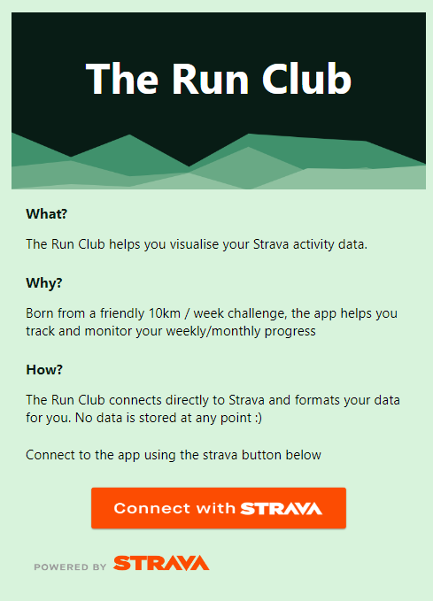

# The Run Club 🏃‍♂️

🔗 https://the-run-club.netlify.app/ \
\*\* The Run Club is the latest version of the now deprecated [StravaJS](https://github.com/jake-stan92/StravaJS2.0)

## Description

As a keen activity tracker and a lover of data, I created The Run Club to collate and display Strava activity data in a clear and concise way. Strava doesn’t offer such detailed activity results – at least in the free tier anyway. The idea was initially born when a small group of friends decided to complete a 10k per week running challenge in 2023. The app has gone through 4 iterations to be where it is currently. Using the [Strava API](https://developers.strava.com/docs/reference/), the app collects the activities of given athletes and then filters results accordingly.

## Tech Stack

Previous iterations of this project have used a PostgreSQL database to store athlete refresh tokens. The app now uses Strava's own OAuth authentication to allow multiple users to authenticate - relieving the need for a backend. The front end is built with React(Vite) and charts created using [Chart.js](https://www.chartjs.org/).

## The Journey

### Iteration 1:

The Run Club (StravaJS) started out as a python script that I would run on my local machine to track our 10km a week challenge. The script would output similar data and charts to Excel but I would have to screenshot these and send to my friends. In addition, my friends would have to ask me to run the script each time they wanted to see updated figures.

### Iteration 2:

From here I created the second iteration of the app which used NodeJS as a back-end, MongoDB as a database and PUG (Jade) as a templating language to display the data. This version included user authentication where my friends could login and see their own results. While this edition allowed users to look up their own activities, it contained some bugs and was very unappealing in terms of UI.

### Iteration 3:

I completed iteration 3 after honing my skills at the School of Code. I went about creating a sleeker looking dashboard with an improved UI and minimal bugs. While the app currently shows only my data, I plan to increase its functionality in the future.

### Iteration 4 (current):

After submitting my project to Strava themselves, they granted an increase in available authenticated users (1 to 999). This allowed me to incorporate their OAuth technology meaning anyone with a Strava account can login and see their activities. Such a change has allowed me to remove the back end and increase the loading speed of the data - no more wrestling with free tier database hosting!

## Future Plans

I plan to release the app to certain groups to gain feedback. Based on this feedback I will look to change/add features to improve the apps useability.
